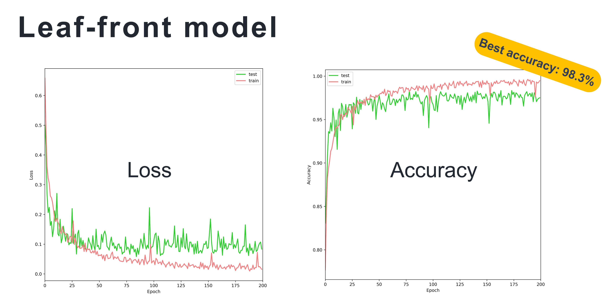

# strawberry-disease-detector
This is a project aimed at detecting strawberry diseases using deep learning, with LINE BOT serving as the user interface.

## Method

### Flow Chart

### Model Training
The model employs transfer learning, utilizing SqueezeNet as the base model. Training is conducted on six classes of strawberry diseases: anthracnose, angular leaf spot, leaf blight, discoloration, lepidoptera larvae, and tetranychus. Approximately 1000 images are used for each class, with 800 images allocated for training and 200 for validation. The training process spans 200 epochs, employing a batch size of 16.

### LINE BOT
The LINE BOT is implemented using the LINE Messaging API. The user can send an image to the BOT, which will then be forwarded to the server for processing. The server will then return the result of the image classification to the user.

## Results

### Performance
After training, the accuracy of the leaf-front model on the validation dataset reached 98.3%; the accuracy of the leaf-back model on the validation dataset reached 99.7%.

### LINE BOT Demo
The user could choose to take a photo of strawberry leaves or select a photo of strawberry leaves from their album through the chatbot function menu. The chatbot would ask the user whether the photo to be taken or selected is of the front of leaves or the back of leaves. 
According to the user's answer, the corresponding model is utilized accordingly. After the image sent to the chatbot, the identification result would be sent back to the chat room in the form of a message, immediately.

